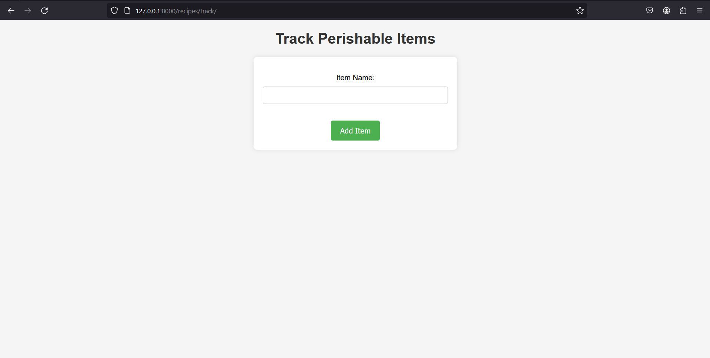

# 🌽🍲 FoodApp - Minimizing Food Waste, Maximizing Flavor

FoodApp is a platform designed to help users minimize food waste through smart tracking, recipe suggestions, and timely reminders. It empowers users to make conscious decisions about their perishable items and contributes to sustainable living.

## ✨ Features

### Track Expiration 📅

- **Perishable Item Management**: Keep track of your perishable items and their estimated expiration dates.
- **Automated Reminders**: Receive timely reminders for items approaching their expiration dates.

### Recipe Suggestions 🍽️

- **Recipe Recommendations**: Get recipe suggestions based on the ingredients you have, reducing food waste.
- **Nutritional Insights**: Track your food intake and nutritional values to make healthier choices.

### Smart Remainders 🕰️

- **Personalized Reminders**: Receive reminders about upcoming expirations and useful tips to minimize waste.
- **WhatsApp Integration**: Conveniently receive reminders on WhatsApp for a seamless experience.

## 🌐 Connect with Us

Stay connected with us on social media for updates, tips, and community discussions:

- Twitter: [@FoodAppOfficial](https://twitter.com/FoodAppOfficial)
- Instagram: [@FoodAppInnovate](https://www.instagram.com/FoodAppInnovate)
- Facebook: [FoodApp](https://www.facebook.com/FoodApp)

## 🌍 How FoodApp Helps

FoodApp aims to reduce food waste by:

1. **Smart Management**: Efficiently manage perishable items, reducing the chances of items going to waste.
2. **Recipe Utilization**: Encourages users to create meals using available ingredients, minimizing unnecessary purchases.
3. **Timely Reminders**: Ensures users are aware of impending expirations, prompting timely use.

## 🚀 Getting Started

To run this project locally, follow these steps:

1. Clone the repository: `git clone <repository-url>`
2. Install the required dependencies: `pip install -r requirements.txt`
3. Start the development server: `python manage.py runserver`
4. Access the application in your browser at `http://localhost:8000`
5. [<video src="https://www.loom.com/share/6b324ee09bb74de19aa89885f5a8f9cb?sid=ce457b77-16bf-4b2f-9ffa-a8a69b5a6a37"></video>](https://www.loom.com/share/6b324ee09bb74de19aa89885f5a8f9cb?sid=6e07f3b2-1c5b-40df-a064-94566e7a4c2c)

## 🤝 Contributing

Contributions to this project are welcome! If you find any bugs or have suggestions for improvement, please open an issue or submit a pull request.

## 📄 License

This project is licensed under the [MIT License](LICENSE).
